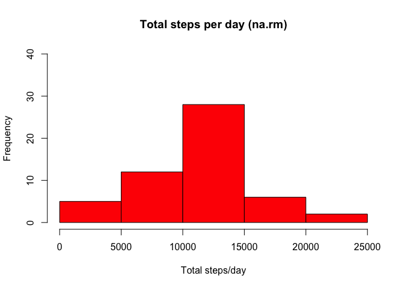
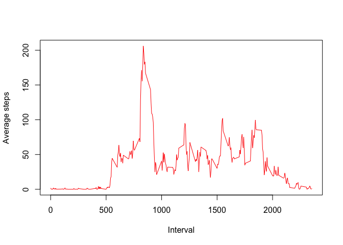
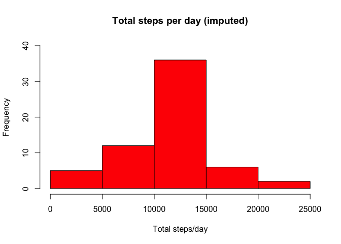
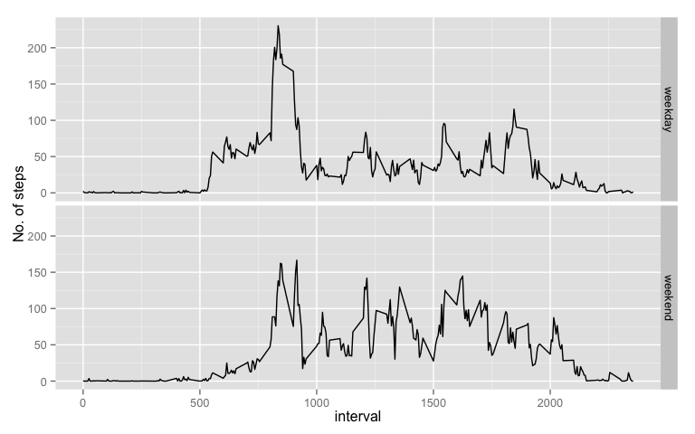

# Reproducible Research: Peer Assessment 1


## Loading and preprocessing the data
This code will load the activity data and add an POSIXct date varible which is required for downstream analysis:

```r
activity <- read.csv("activity.csv")
library(lubridate)
activity$lubridate <- ymd(activity$date)
```
Note that the 5 minute interval variable is not numbered consecutively (e.g. every 5 minutes up to 55, then jump to 100, presumably at the next hour.) This could influence look of the graphs in this assignment.

## What is mean total number of steps taken per day?
This code will remove NA's from the dataset and the dplyr package will be used to calculate the total number of steps taken per day:

```r
# Magrittr necessary for proper implementation in knitr.
library(magrittr)
library(dplyr)
```

```
## 
## Attaching package: 'dplyr'
## 
## The following objects are masked from 'package:lubridate':
## 
##     intersect, setdiff, union
## 
## The following objects are masked from 'package:stats':
## 
##     filter, lag
## 
## The following objects are masked from 'package:base':
## 
##     intersect, setdiff, setequal, union
```

```r
complete <- complete.cases(activity)
comp_activity <- activity[complete, ]

result1 <-
comp_activity %>%
    group_by(lubridate) %>%
    summarize(sum_steps = sum(steps)
    )
```
This code will plot a histogram of total steps taken per day.

```r
hist(result1$sum_steps, xlab = "Total steps/day", col = 2, bg = "white", main = "Total steps per day (na.rm)", ylim = c(0,40))
```

 


```r
totalSteps <- result1$sum_steps
mean_steps <- mean(totalSteps)
median_steps <- median(totalSteps)
```
The mean number of steps is 1.0766189\times 10^{4} and the median number of steps taken is 10765.
Note that the calculation of the median can be troublesome in R. See the following [link]( http://stackoverflow.com/questions/5902183/odd-behavior-with-median) for further information.

## What is the average daily activity pattern?
This code will calculate the average steps taken per interval:

```r
result2 <-
comp_activity %>%
    group_by(interval) %>%
    summarise(avg_interval = mean(steps))
```
This code will plot the average daily steps per interval.

```r
plot(result2$interval, result2$avg_interval, xlab = "Interval", ylab = "Average steps", col = 2, bg = "white", main = "", type = "l")
```

 

## Imputing missing values

```r
totalNA <- sum(is.na(activity))
```
The total number of NA's in the dataset is 2304.

To impute values for the missing NA's, the average steps taken per interval will be calculated and inserted into the dataset (similar to what was done above).

```r
result3 <-
activity %>%
    group_by(interval) %>%
    mutate(avg_steps = mean(steps, na.rm = TRUE))
 
result4 <- transform(result3, combined = ifelse(is.na(result3$steps), avg_steps, steps))
```
This code will plot a histogram of the imputed data:

```r
result5 <-
    result4 %>%
    group_by(lubridate) %>%
    summarize(sum_steps = sum(combined)
    )

hist(result5$sum_steps, xlab = "Total steps/day", col = 2, bg = "white", main = "Total steps per day (imputed)", ylim = c(0,40))
```

 


```r
totalStepsImp <- result5$sum_steps
mean_stepsImp <- mean(totalStepsImp)
median_stepsImp <- median(totalStepsImp)
```
The mean number of steps is 1.0766189\times 10^{4} and the median number of steps taken is 1.0766189\times 10^{4}.
Neither the mean nor the median changed very much after the addition of imputed values. However, the two histograms (w/o NA's and with imputed values) differ mostly in the 10,000-15,000 steps per day bin. It seems as if there were a number of days with very little data (lots of NA's) and the addition of imputed data put them into the "average" bin.

## Are there differences in activity patterns between weekdays and weekends?
This code will create a factor variable to separate 'weekday' and 'weekend' data and analyze average steps per interval:

```r
result4$day <- weekdays(result4$lubridate)
week.code <- c(weekday = "Monday", weekday = "Tuesday", weekday = "Wednesday", weekday = "Thursday", weekday = "Friday", weekend = "Saturday", weekend = "Sunday")
result4$week <- as.factor(names(week.code)[match(result4$day, week.code)])

result6 <-
    result4 %>%
    group_by(week, interval) %>%
    summarize(last = mean(combined))
```
This code will generate a plot of the above data:

```r
library(ggplot2)
qplot(interval, last, data = result6, geom = "line", facets = week~., ylab = "No. of steps")
```

 

## Analysis

Why is there a spike of activity in what appears to be the morning? Maybe she goes for a run. It doesn't seem to be walking to work, unless she takes a cab at home at night. Here we go: wake up during the week, **ten** cups of coffee, then off to work and abstain from any additional coffee drinking :)    
